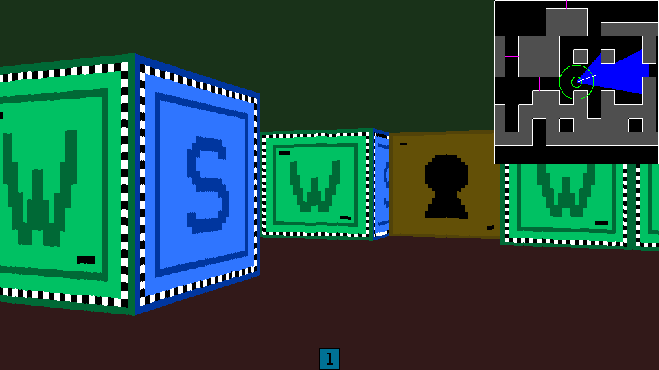

# Cub3D

By `cigarcia` and `apena-ba` at 42 Málaga

## Screenshots

## Features

- [x] Wall collisions
- [x] Sprite rendering and animation from spritesheet
- [x] Textures (multiple size support)
- [x] Doors that open and close, with collision
- [x] Minimap
- [x] Sprinting

## Controls

- `WASD` to move
- `← →` or mouse movement to rotate
- `ESC` to exit
- `SPACE` or `RMB` to open/close doors
- `LMB` to shoot
- `SHIFT` to sprint